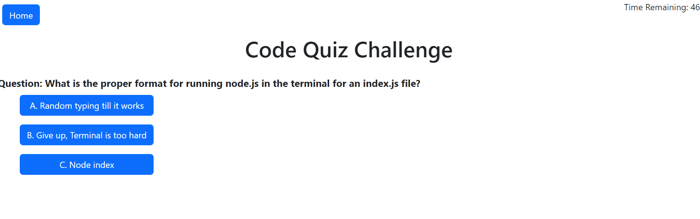

# ch4_code_quiz

## Description

This Challenge was the creation of a Code Quiz(https://kaneknah.github.io/ch6_baxley_weather_page/) that would utilize CSS, Java Script, HTML, JQuery, and Bootstrap to create a clean and fresh webpage that responds to user input while actively and passively performing the required functions.

This challenge caused quite a bit of difficulty for me as it took a great deal of time to finish. However, this struggle greatly improved my skills in writing Java Script functions, Jquery usage and, as well as CSS aspects of the code. While this challenge can be off putting at the amount of time it required, the resulting webpage, I feel, exhibits a greater understanding of code than other projects before. Not only did I improve on my ability to write JavaScript functions, but I also took this challenge as an opportunity to expand my usage of Bootstrap CSS frameworks. While not an overt aspect of the challenge, the practice with Bootstrap built even more confidence in my abilities.

This challenge, while demanding, provided me with a great deal of practice and greatly helped build my confidence in my abilities. I feel my understanding of syntax and function processes has increased the most during this challenge and I am proud to see a final product that functions and operates correctly.

The functionality of this challenges is as follows. On the initialization of the quiz. A set of functions to run a countdown begins. A separate set of functions will also run that will cycle though an array of questions and render them to the HTMl, creating the answers options as selectable buttons for the user.
When the user selects an answer, they will be presented with the next question. Behind the scenes, a score will be added if the questions is correct. if it is incorrect, time will be deducted from the timer. The user will also be given a notification on if they were correct or not.
Finally, When the user selects the answer to the final question. The endgame function will present him with the option to save his score. It will do this while ending the timer, removing created HTML elements, and accessing the localStorage for saving data.

## User Story

AS A coding boot camp student
I WANT to take a timed quiz on JavaScript fundamentals that stores high scores
SO THAT I can gauge my progress compared to my peers

## Acceptance Criteria

GIVEN I am taking a code quiz
WHEN I click the start button
THEN a timer starts and I am presented with a question
WHEN I answer a question
THEN I am presented with another question
WHEN I answer a question incorrectly
THEN time is subtracted from the clock
WHEN all questions are answered or the timer reaches 0
THEN the game is over
WHEN the game is over
THEN I can save my initials and score

## Installation

No Installation Steps

## Usage

This project can be initiated by the "start" button. The webpage will then cycle though a list of questions for the user to answer by selecting the correct answer button. A timer will countdown s the user progresses and time will be deducted for wrong answers. When the user completes the final question OR the timer runs out. The user will be showed their score and will be given the opportunity to save their initials. The user will have to opportunity to restart the quiz at anytime though the present "home" button in the top left corner.  

## Credits

CSS framework provided by Bootstrap
Javascript Library features provided by JQuery https://jqueryui.com/.

## License

N/A
